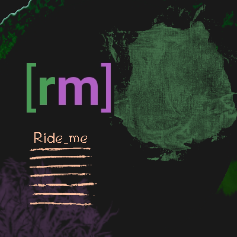

# Ride me
> **Ride me** is a BMX bike race. 
> You can improve your bike handling skills, 
> upgrade the performance of your bike 
> and set new records on the tracks. Come on!

### RideMe game with using Kivy framework.
Use packages:
* Kivy: https://kivy.org/#home
* Buildozer: https://github.com/kivy/buildozer
* Linux packages source: https://sources.voidlinux.org/ 

### Install environment:
	
	git clone https://github.com/marychev/ride_me
	cd ride_me
	python3 -m virtualenv venv
	. venv/bin/activate
	pip install -r requirements.txt
	python main.py 

#### Run game:

	cd ride_me
    . venv/bin/activate
    python main.py 

#### Run tests

    python -m pytest tests/

#### Deploy for android

    buildozer init

Go to the *buildozer.spec* and edit it, then type, **version**

    buildozer android debug deploy run

[Packages source](https://sources.voidlinux.org/) for some broken libs: 
*sdl2, sdl2_image, sdl2_ttf, sdl_mixer ...* for deployment or building. 
Path local building libs `YOUR_APP/.buildozer/android/platform/build-armeabi-v7a/packages/`

